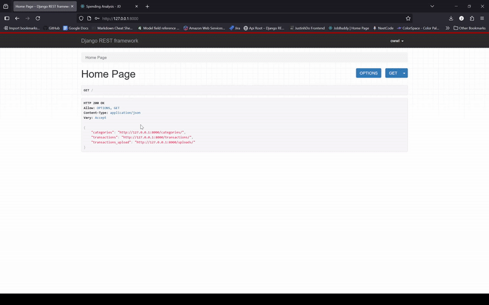

# Spending Analysis Application 

## Objective 

Spending Analysis helps **reduce costs** by learning about **spending patterns** through tracking and analysis of financial data. This **RESTAPI** will take in *CSV* files as input, processes and categorizes spending data, and generates charts and actionable results.

## MVP Key Features 

**Upload CSV**
- Our application should accept CSV files 
- *Date*, *Vendor*, *Category*, *Amount*

**Parse & Store Data**
- `pandas` to parse rows 
- API should be able to return all of our transactions (Each row should be in our database)

**Key Endpoints**
- *Top Vendors* 
- *Spending Via Category*
- *Monthly Trend*

## Expenditure CSV Example 

We'll be building this RESTFul Application around a CSV that looks like this:

```csv
Date,Vendor,Category,Amount
2025-06-01,Walmart,Grocery,124.56
2025-06-03,Amazon,Shopping,89.99
2025-06-05,Netflix,Entertainment,15.99
2025-06-08,Duke Energy,Utilities,103.21
2025-06-10,Uber,Transport,25.00
```

[Sample CSV File](sample_transactions.csv) 

## Development Tracking 

**07/11/25**
- Django + Django Restframework 
- Added URLS and built Default Routers 
- Set Default Authentication as `SessionAuthentication` 
- Set Default Permission to `IsAuthenticatedOrReadOnly`
- Added Authentication urls: `path('api-auth/', include('rest_framework.urls')),`
- Created Category Viewset for full CRUD 
- Created Home Page functional API view to return the **reverse** links to all of our API 
- Made Transactions ListCreate + RetrieveUpdateDelete API views 
- Tied hyperlinks to each view via (URL in serializer)

Result: Full CRUD operations on Transactions + Categories with hyperlinks and customized Serializers.

---

**07/12/25**
- Planning for API Accept CSV 
  - Pandas data manipulation 
  - Return meaningful/actionable insights 
- `ListCreate` now accepts CSV, creates Category: `get_or_create` builds transactions, Provides summary 
- Hyperlink Transactions --> File Upload 
- Individual File Upload URL should direct us to a summary + nested Transactions 
- Summary => Rebuild all the data from **prefetched transactions**, Dataframe then:
  - Total Spent
  - Spending Per Category: Group By Category, Access Amount, Sum, Sort via Descdening, Transform to Dictionary 
  - Top Vendors: Group By Vendor, Access Amount, Sum, Sort via Descdening, Head(n), Transform to Dictionary
- Summary Url => `SerializerMethodField` 
  - Make sure we get request through: `self.context.get('request')` and we're using `from rest_framework.reverse import reverse`
  - `reverse('api_name', args=[obj.id], request=request, format=None)`
  - Need to supply the id since we have `<int:upload_id>` in our url 
  
Result: API View accepts CSV Uploads, creates Transactions + Categories. Summary API for files based on related transactions.

**07/14/25**
- Corsheaders for React Frontend 
- `"corsheaders"` in settings.py and `pip install django-cors-headers`
- Disabled Permissions because we are not using SJWT
- Connected Frontend with CSV Upload 

Result: React frontend works with uploaded CSV files + Displays Summary Report



**07/15/25**
- Plans:
  - Improve Summary? (Monthly Totals (money/time)-> Category Growth (% increase/decrease))
  - Build Dashbaord for file uploads + Summary access
  - Look into how Tableau could help our App (FastAPI/Flask Microservice)
  - AI plans -> Smart summaries -> Translate raw analytics into executive-friendly reports or actionable suggestions (FastAPI/Flask Microservice)
- Added Media Root + Url to `urls.py` using: `MEDIA_URL = os.path.join(BASE_URL, 'media')`
- File Name instance method for serializer to display individual file names
- Summary now includes
  - Number of **Categories**, **Vendors** 
  - Date Range **Max** and **Min**
  - **Spending per Vendor**
  
Result: More information on Summary to display on frontend. Media Files are viewable locally. Plans for microservices.


**07/16/25**
- **WeasyPrint** for Template -> PDF 
- Django Bootstrap CDN for templates (Need the **Bootstrap.min.css** static files instead: [here](https://getbootstrap.com/docs/5.3/getting-started/download/))
- [GTK for WeasyPrint](https://github.com/tschoonj/GTK-for-Windows-Runtime-Environment-Installer/releases)
  - If Production make sure you dockerize your container with this dependencny 
- WeasyPrint need `base_url` to access our static files 
- Use Django `HTTPResponse` to set the content type as `application/pdf` 
- Proviide the `Content-Disposition` as `attachment; file="filename_here.pdf"`

Result: API View that downloads a PDF version of our template based on HTML string.


**07/17/25**
- Docker + Kubernetes Deploy 
- Dockerize Django 
  - Staticfiles: `STATIC_ROOT` 

Dockerfile:
```
# Base Image
FROM python:3.10-slim

# No Bytecode + unbuffered 
ENV PYTHONDONTWRITEBYTECODE = 1
ENV PYTHONUNBUFFERED = 1

# GTK Requirements for WeasyPrint
RUN apt-get update && apt-get install -y \
    build-essential \
    libpango-1.0-0 \
    libgdk-pixbuf2.0-0 \
    libffi-dev \
    libglib2.0-0 \
    libcairo2 \
    libpangoft2-1.0-0 \
    libpangocairo-1.0-0 \
    libxml2 \
    libxslt1.1 \
    libjpeg-dev \
    zlib1g-dev \
    && rm -rf /var/lib/apt/lists/*
```

Dockerfile: Create WD, Copy + Install requirements, Copy the entire project then collect static files:

```
# Create WD
WORKDIR /app

# Copy and Install requirements 
COPY requirements.txt . 
RUN pip install -r requirements.txt 

# Copy the entire project 
COPY . .

# Collecting static files 
python manage.py collectstatic
```

Dockerfile: Gunicorn to run application based on WSGI 

```
CMD ["gunicorn", "spending_analysis.wsgi:application", "--bind", "0.0.0.0:8000"]
```

Docker-Compose: Set Version, Build your DJango Webservice

```
version: '3.9'

services:
  # Django Spending Analysis
  web:
    build: .
    container_name: spending_analysis
    command: gunicorn spending_analysis.wsgi:application --bind 0.0.0.0:8000
    volumes:
      - .:/app
      - ./staticfiles:/app/staticfiles
    ports:
      - "8000:8000"
    depends_on:
      - weasydeps

```
- Conttainer Name 
- Command 
- Volumes -> we set our staticfiles 
- Expose the port 
- Depends on weasydeps which we'll build next 


```
  weasydeps:
    image: alpine
    container_name: weasydeps
    command: tail -f /dev/null  # dummy container if you want to later separate GTK deps
```
- Secondary service for our dependencies 

```bash
docker-compose build
docker-compose up 
```
1) Make sure staticfiles is there
2) access the shell: `docker exec -it container_name bash`
3) migrate database: `python manage.py migrate`

## Kubernetes?

**K8s Cluster** is a set of **nodes** that run *containzered* application. **Master Node** manages cluster for **pods** to handle scaling, updates etc. **Worker Nodes** that runs your application in **pods**.

How do we deploy our containerized applicaiton on Kubernetes?
- After **containerized application** we want to spin up a **pod** which wraps around our container to run on a **Worker Node**
  - `k8s/deployment.yaml`: **container image** -->  deployment name 
  - `k8s/service.yaml`: exposes Pod on a port 
- Enable Kubernetes on Docker Desktop
  - `kubectl appply -f` to both the deployment + service 
  - `kubectl get svc podname` we get podname with `kubectl get pods`
  - Go to your port and now: Containerized Application running inside a **Pod** on a **Worker Node** that is managed by the **Master Nod (Control Plane)** within the **Kubernetes Cluster**


## Snowflake? Datapipelines? Dagster?

DataPipeline:
1) Ingest: Fetching JSON or Data 
2) Load: Store in Snowflake 
3) Transofrm: Flatten out some fields 
4) Consume: BI Tool or other API reads from Snowflake

> ETL (Extract Transofrm Load) FastAPI for SwaggerUI that calls my Django Backend for all the uploaded files... 
> 
> then for each uploaded files we'll transform them via Vertex AI (Adding on more insightful data) 
> 
> then loading this into snowflake.


**07/22/25**
- Issue with the Date in Pandas 
- `df['Date'] = pd.to_datetime(df['Date'], format='%b-%d-%Y', errors='coerce')`
  - We needed to set the format to read: `Dec-15-2025` and other dates in this format 
- 